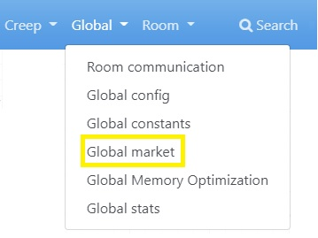

# PandaBot, an artificial intelligence bot for Screeps

## GitKraken board *(trello alternative)*

**[Board](https://app.gitkraken.com/glo/board/YB7eUM0RFgBXNrw-)**

## The goal of this page is to show each part of the bot

There are three main categories. Keep those in mind, its going to be important later on.

1. Global
2. Room
3. Creep

Each of those categories execute code based on their category, they can communicate with each other but only one category up or down.

Click on a part to see detailed information on the workings of that part
Note: Each part can be found on multiple categories and their logic does change a little bit then.

## All parts sorted by category

### Global

- Config
- Constants
- Stats
- Market
- Memory optimization
- Communication

### Room

- Config
- Constants
- Stats
- Jobs
- Market
- Defending
- Communication (Room)
- Structure communication
- Map reading
- Room planner
- Request creep
- Structure building

### Creep

- Config
- Constants
- Stats
- Communication
- Creep sayings

To see detailed information on a part see their category in the navigation bar.

Example selecting the market from the **Global** category:

