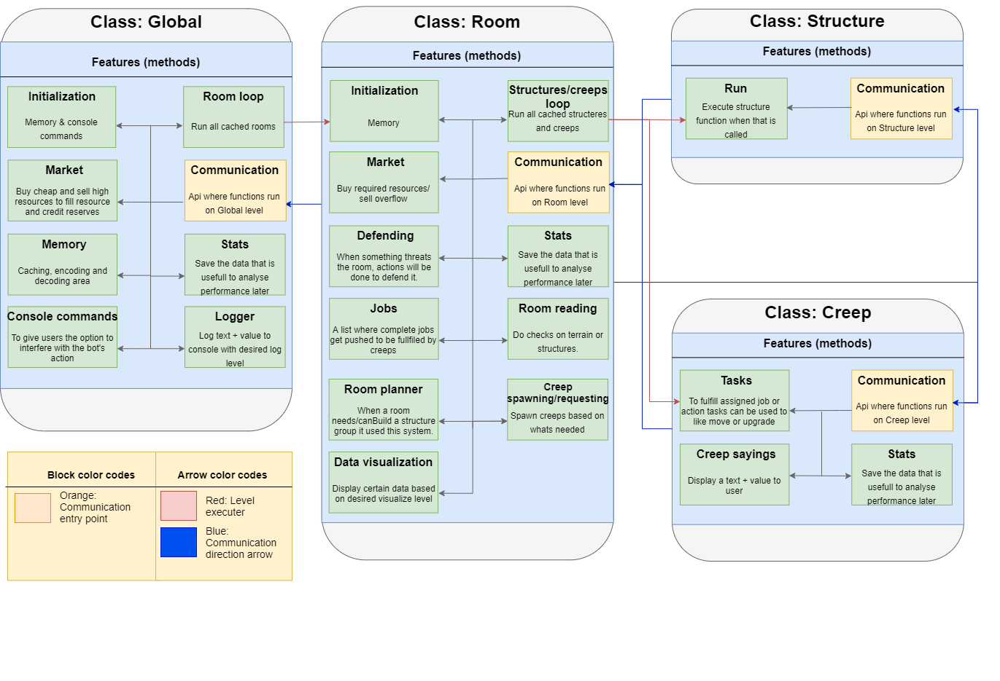

####################################
Welcome to Pansiep's documentation!
####################################

.. warning::
   There is currently no code yet so all functions/config/constants tables are empty!
   Expect change soon.

.. note::
   This documentation is about a game called `Screeps <https://screeps.com>`_ which is a JS based Real time MMO.
   To read more about the game go to their `Docs <https://docs.screeps.com/index.html>`_ or `API <https://docs.screeps.com/api/>`_

   `My GitKraken Board <https://app.gitkraken.com/glo/board/YB7eUM0RFgBXNrw->`_
   
   Feel free to contact me on the Screeps slack at **@pandamaster** if you have any questions.

   *To contribute to this project please see `CONTRIBUTING <./CONTRIBUTING.html>` or contact me on slack.*

********************
Short bot description
********************

The bot is focussed on reliability and communication between the classes.

To fullfil the needs of the colony there will be complete jobs in each room to be fulfilled by creeps.
Based on the situation and job list the needed creeps get spawned or recycled.

Using the communication the rooms and creeps can communicate with each to create a system where on a attack or job overflow. When the room can't manage something he can request help without much hassle.

********************
Framework overview
********************

Classes
========

Global
------

Every tick the manager will be called to run everything that needs to be executed. 

After a check to see if the manager is initialized, all cached rooms and Global features will be called.

To be focus on lowering cpu usage all features that can be globalized will be globalized. A good example is the `Global market <./global/market.html>`_, this feature is included in **Room** class but there it is only to manage stored resource and not analyse the market.

.. toctree::
   :maxdepth: 1
   :numbered:
   :caption: Global
   :glob:
   :hidden:
   
   global/*

Room
------------------------

Every room can run different based on the circumstances. Mostly based on its creeps, structures and room state.

The creeps and structures a room has acces too will be used to fullfil **Room** features like create jobs.

A room does make the choice if it should run its creeps and structures when the bucket is low.

The different classes beside global can be described as a body:

- Head: Room, calculating things the body uses
- Heart: Structure, without the structures the room can't do anything major.
- Arms/legs: Creep, the room/structures can't do anything without the creeps to fullfil their requests.
If one is missing or faulty the flow is not optimal.

.. toctree::
   :maxdepth: 1
   :numbered:
   :caption: Room
   :glob:
   :hidden:
   
   room/*

Structure
--------------------------------

Structure will do its functions when needed or required. Sometimes a structure can tell a room that its structure needs a action when a room didn't saw that yet.

The creep is mostly the one executing the required needs of a room.

.. toctree::
   :maxdepth: 1
   :numbered:
   :caption: Structure
   :glob:
   :hidden:
   
   structure/*

Creep
------

A creep should always try to fulfill jobs from the job queue. When no job is found it should wait for a job and after a specific amount of ticks it should get recycled if there is still no job.

.. toctree::
   :maxdepth: 1
   :numbered:
   :caption: Creep
   :glob:
   :hidden:
   
   creep/*

.. toctree::
   :maxdepth: 1
   :caption: Pansiep
   :hidden:

   CONTRIBUTING
   CODE_OF_CONDUCT